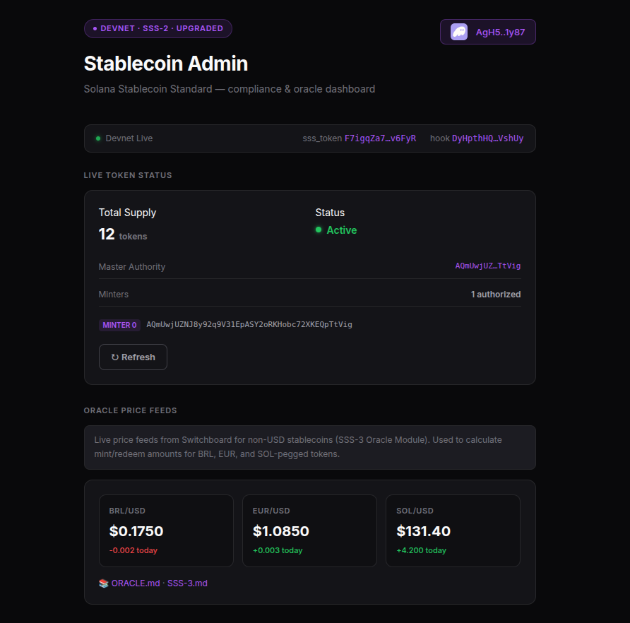
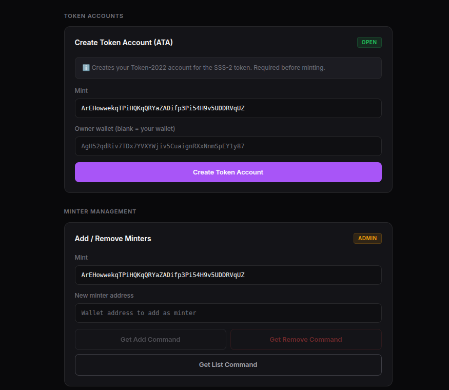
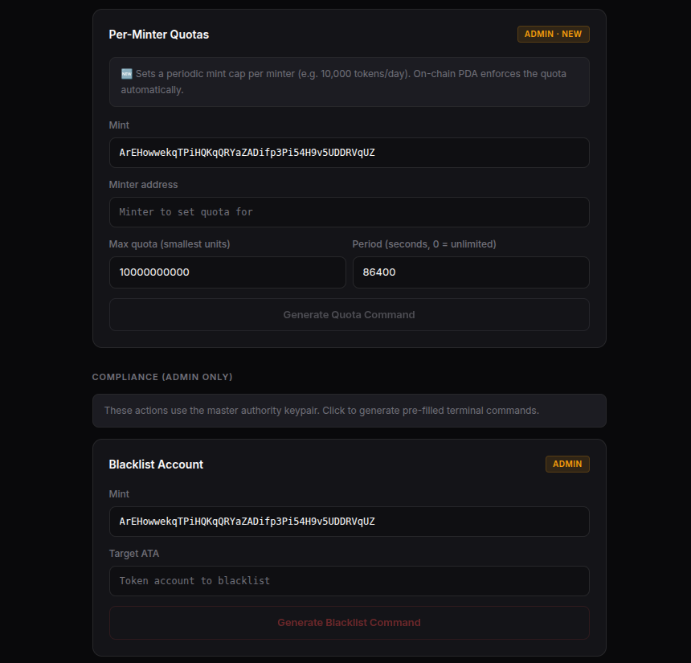
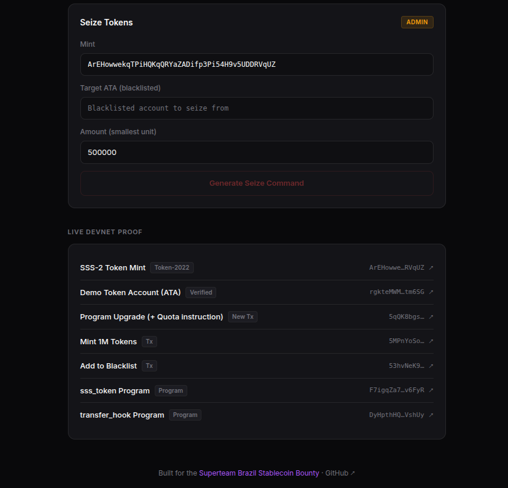
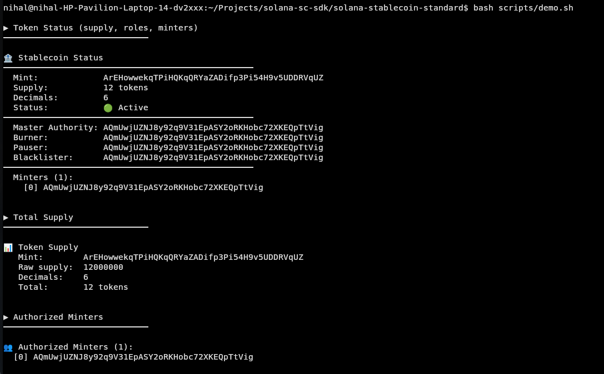
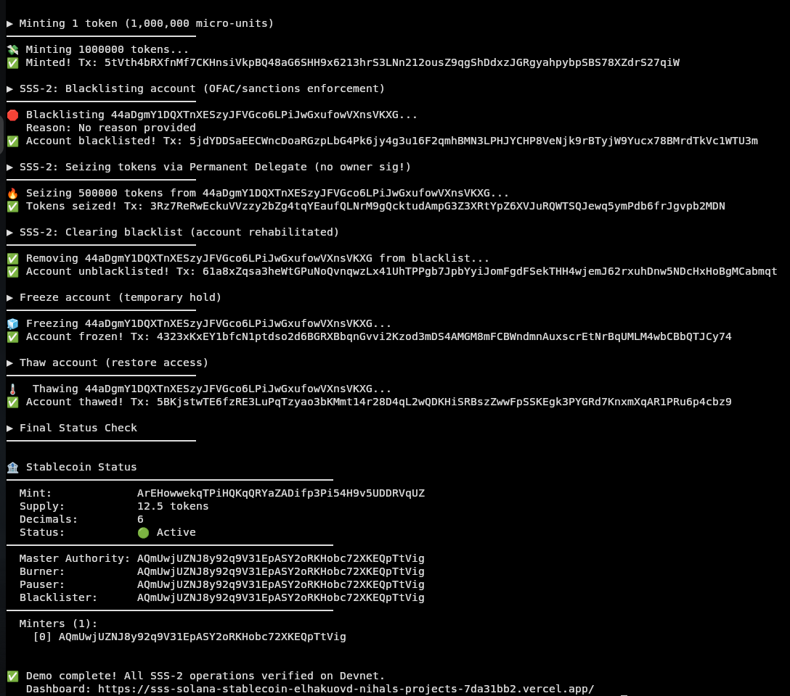

# Solana Stablecoin Standard (SSS)

[](https://github.com/solanabr/solana-stablecoin-standard)
[](./tests)
[](https://www.anchor-lang.com/)
[](https://spl.solana.com/token-2022)
[](https://opensource.org/licenses/MIT)

## 🌐 Live Demo &nbsp;|&nbsp; 🎥 Demo Video

> **[→ Launch Web Dashboard](https://sss-solana-stablecoin-sdk.vercel.app/)** — connect Phantom (Devnet) to interact live

> **[▶️ Watch the 5-minute demo video](https://youtu.be/ZdRW4Zp-b0Q)** — SSS-2 blacklist + seizure live on Devnet

### Dashboard

<table>
  <tr>
    <td></td>
    <td></td>
  </tr>
  <tr>
    <td></td>
    <td></td>
  </tr>
</table>


> **The open-source SDK and core standards for stablecoins on Solana** — a production-ready, modular toolkit for institutions and builders to deploy USDC/USDT-class compliant stablecoins using Token-2022.

## 🗺️ What Is This?

Think **OpenZeppelin for Solana stablecoins**. The SDK is the library; SSS-1 and SSS-2 are the standards — opinionated presets that get adopted.

```
Layer 3 — Standards:  SSS-1 (Minimal)  •  SSS-2 (Compliant)  •  SSS-3 (Private, PoC)
Layer 2 — Modules:    Compliance  •  Oracle  •  Privacy (confidential transfers)
Layer 1 — Base SDK:   Token creation  •  Role management  •  CLI  •  TypeScript SDK
```

Built for the [Superteam Brazil Stablecoin Bounty](https://earn.superteam.fun/listings/bounties/build-the-solana-stablecoin-standard) · Reference: [Solana Vault Standard](https://github.com/solanabr/solana-vault-standard)

---

## 📦 Standards at a Glance

| Standard | Name | What It Is |
|---|---|---|
| **SSS-1** | Minimal Stablecoin | Mint + Burn + Freeze + Pause + Role management. Everything a stablecoin needs, nothing more. |
| **SSS-2** | Compliant Stablecoin | SSS-1 + Transfer Hook + Permanent Delegate + on-chain Blacklist. USDC/USDT-class compliance. |
| **SSS-3** | Private Stablecoin | SSS-2 + Confidential Transfers (ZK proofs). Forward-looking PoC; tooling maturing. |

---

## 🚀 Quick Start

### 1. Clone & Build

```bash
git clone https://github.com/solanabr/solana-stablecoin-standard
cd solana-stablecoin-standard
yarn install && anchor build
```

### 2. Run Tests (19/19 passing)

```bash
anchor test
```

### 3. TypeScript SDK

```typescript
import { SolanaStablecoin, defineStablecoin, mintTokens, addToBlacklist, seizeTokens, Preset } from "@solana-stablecoin-standard/sdk";

const sdk = new SolanaStablecoin(connection, wallet);

// Initialize an SSS-2 compliant stablecoin
const sig = await defineStablecoin(sdk, authority, mintKeypair, {
  preset: Preset.SSS2,
  decimals: 6,
  masterAuthority: authority.publicKey,
  minters: [authority.publicKey],
});

// Mint 1M tokens (1.0 with 6 decimals)
await mintTokens(sdk, minter, mint, recipientAta, 1_000_000);

// SSS-2 compliance
await addToBlacklist(sdk, authority, mint, suspiciousAta);
await seizeTokens(sdk, authority, mint, suspiciousAta, 500_000);
```

### 4. CLI (Full Command Reference)

```bash
cd packages/cli

# Token lifecycle
npx ts-node src/index.ts init      -u <RPC> -k <KEYPAIR>
npx ts-node src/index.ts mint      -u <RPC> -k <KEYPAIR> --mint <ADDR> --target <ATA> --amount <N>
npx ts-node src/index.ts burn      -u <RPC> -k <KEYPAIR> --mint <ADDR> --target <ATA> --amount <N>
npx ts-node src/index.ts freeze    -u <RPC> -k <KEYPAIR> --mint <ADDR> --target <ATA>
npx ts-node src/index.ts thaw      -u <RPC> -k <KEYPAIR> --mint <ADDR> --target <ATA>
npx ts-node src/index.ts pause     -u <RPC> -k <KEYPAIR> --mint <ADDR>
npx ts-node src/index.ts unpause   -u <RPC> -k <KEYPAIR> --mint <ADDR>

# Monitoring
npx ts-node src/index.ts status    -u <RPC> -k <KEYPAIR> --mint <ADDR>
npx ts-node src/index.ts supply    -u <RPC> -k <KEYPAIR> --mint <ADDR>
npx ts-node src/index.ts holders   -u <RPC> -k <KEYPAIR> --mint <ADDR> --min-balance <N>

# Minter management (new)
npx ts-node src/index.ts minters list    -u <RPC> -k <KEYPAIR> --mint <ADDR>
npx ts-node src/index.ts minters add    -u <RPC> -k <KEYPAIR> --mint <ADDR> --minter <ADDR>
npx ts-node src/index.ts minters remove -u <RPC> -k <KEYPAIR> --mint <ADDR> --minter <ADDR>

# SSS-2 compliance
npx ts-node src/index.ts blacklist:add    -u <RPC> -k <KEYPAIR> --mint <ADDR> --target <ATA>
npx ts-node src/index.ts blacklist:remove -u <RPC> -k <KEYPAIR> --mint <ADDR> --target <ATA>
npx ts-node src/index.ts seize            -u <RPC> -k <KEYPAIR> --mint <ADDR> --target <ATA> --amount <N>

# TUI Dashboard
npx ts-node src/index.ts dashboard -u <RPC> -k <KEYPAIR>
```

### 5. Docker Backend

```bash
# Start Postgres + Mint Service API + Indexer
docker compose up

# Verify
curl http://localhost:3000/health
```

---

## 🌐 Devnet Deployment

> **Live on Devnet — no setup required to verify.**

| Item | Address |
|---|---|
| **sss_token program** | [`F7igqZa75yYPnXBBKUK3hDwEmtfwUWogEcWMsh5v6FyR`](https://explorer.solana.com/address/F7igqZa75yYPnXBBKUK3hDwEmtfwUWogEcWMsh5v6FyR?cluster=devnet) |
| **transfer_hook program** | [`DyHpthHQhvcuywjyV4nBjpEZbM1PfP71wAn84nkVshUy`](https://explorer.solana.com/address/DyHpthHQhvcuywjyV4nBjpEZbM1PfP71wAn84nkVshUy?cluster=devnet) |
| **Demo SSS-2 Mint** | [`ArEHowwekqTPiHQKqQRYaZADifp3Pi54H9v5UDDRVqUZ`](https://explorer.solana.com/address/ArEHowwekqTPiHQKqQRYaZADifp3Pi54H9v5UDDRVqUZ?cluster=devnet) |
| **Demo ATA** | [`rgkteMWMQyxQtpkQyK6jkbeYbHsnAsiCzKqwygtm6SG`](https://explorer.solana.com/address/rgkteMWMQyxQtpkQyK6jkbeYbHsnAsiCzKqwygtm6SG?cluster=devnet) |
| **Authority wallet** | `AQmUwjUZNJ8y92q9V31EpASY2oRKHobc72XKEQpTtVig` |

### Live Transaction Proof

| # | Operation | Tx Link |
|---|---|---|
| 1 | Initialize SSS-2 token | [79np4eqY…](https://explorer.solana.com/tx/79np4eqY21JiHjmhfhP2FyGbdLgicpqBbLZXhcRXW69w5cXby9wvFHKDi2XoX9qXXJFoNg9uBmQ2WLy7mdJr3j4?cluster=devnet) |
| 2 | Mint 1,000,000 tokens | [5MPnYoSo…](https://explorer.solana.com/tx/5MPnYoSo8KzujXiPLoh1b17PQHG47wCdZtp5f2HpFwYFS3TMYVbvWUmnt7uW1vHriU5wWHCTYNCF47LNQZpRe7cV?cluster=devnet) |
| 3 | Add to blacklist | [53hvNeK9…](https://explorer.solana.com/tx/53hvNeK9UQp55hpBhZETaxL9LS4tvnWBM6oo2dSki5qJ9JLkkRJQryJ5Gsky2xGtg7xs8eTDsG4edwfbLg5eZYag?cluster=devnet) |
| 4 | Transfer blocked by hook ⚠️ | [QBZqnmRX…](https://explorer.solana.com/tx/QBZqnmRXVgGD3hs1LNv1dzRcP6Mq49tDriHe36cwtJJmT2QwwRpZxYY1kPWZvKHjAbFuSikZ228vsRQ4nMkTxwL?cluster=devnet) |
| 5 | Seize 500,000 tokens | [5EoEj7jY…](https://explorer.solana.com/tx/5EoEj7jYSepcwVDZXCVmG9d6kUfsTgcG1yW1LiXeXFRbaojQq1HZbi6buMMmL4jPydiRa3uxJ37QctzkAGgu4H7K?cluster=devnet) |
| 6 | Remove from blacklist | [5wuCCF51…](https://explorer.solana.com/tx/5wuCCF51BQtt8rRCBQg4nVwWtKGSJjQm6kj6aLB9bccEZTKKcMmwCBNtX1mLLyrfCPi7hjhq1TFag55maV419WV3?cluster=devnet) |
| 7 | **Program upgrade (+ Quota instruction)** | [5qQK8bgs…](https://explorer.solana.com/tx/5qQK8bgsCv6bnAxEW1QtyjarxsN1KRWVPUZZCcGUyAHUzhtRX9nqLzUGk5ZQGRQt4u4ptCoErdXppozXXkdvZ3dC?cluster=devnet) |

---

## 🧪 End-to-End Testing Guide (For Judges)

Everything is pre-deployed. You need: Node v20+, Solana CLI, Yarn, ~0.05 SOL on Devnet.

### Prerequisites

```bash
solana config set --url devnet
solana balance   # fund from faucet.solana.com if <0.1 SOL
```

### Option A — Web Dashboard (Easiest)

> **[→ Launch Dashboard](https://sss-solana-stablecoin-sdk.vercel.app/)** — no CLI needed.

1. Open the link and click **Select Wallet** → Phantom → Approve
2. Set Phantom to **Devnet** (Settings → Developer Settings → Change Network)
3. The dashboard will automatically load live token state, minters list, and oracle prices
4. Click **Create Token Account** to create your ATA for the demo mint
5. Run CLI commands for blacklist/seize using the pre-filled command generators

### Terminal Demo





### Option B — Interactive TUI Dashboard

```bash
git clone https://github.com/solanabr/solana-stablecoin-standard
cd solana-stablecoin-standard && yarn install && anchor build

cd packages/cli
npx ts-node src/index.ts dashboard \
  -u https://api.devnet.solana.com \
  -k ~/.config/solana/id.json
```

Follow prompts:
| Prompt | Value |
|---|---|
| Mint PublicKey | `ArEHowwekqTPiHQKqQRYaZADifp3Pi54H9v5UDDRVqUZ` |
| Recipient Wallet | `<your wallet address from solana address>` |
| Amount | `1000000` (= 1 token) |

### Option C — Direct CLI

```bash
MINT=ArEHowwekqTPiHQKqQRYaZADifp3Pi54H9v5UDDRVqUZ
RPC=https://api.devnet.solana.com
KEY=~/.config/solana/id.json

# Check token status
npx ts-node packages/cli/src/index.ts status --mint $MINT -u $RPC -k $KEY

# Check supply
npx ts-node packages/cli/src/index.ts supply --mint $MINT -u $RPC -k $KEY

# List minters
npx ts-node packages/cli/src/index.ts minters list --mint $MINT -u $RPC -k $KEY

# Mint tokens to your wallet
MY_WALLET=$(solana address)
npx ts-node packages/cli/src/index.ts mint \
  --mint $MINT --target $MY_WALLET --amount 1000000 -u $RPC -k $KEY
```

---

## 🏗 Repository Structure

```text
solana-stablecoin-standard/
├── programs/
│   ├── sss_token/              # Core admin program (Anchor)
│   │   └── src/
│   │       ├── lib.rs          # Entry point — 12 instructions
│   │       ├── state.rs        # StablecoinState + Blacklist + MinterQuota PDAs
│   │       ├── errors.rs       # Typed error codes
│   │       └── instructions/   # One file per instruction
│   │           ├── initialize.rs, mint.rs, burn.rs, freeze.rs
│   │           ├── pause.rs, seize.rs, blacklist.rs
│   │           ├── transfer_authority.rs, minter_quota.rs
│   └── transfer_hook/          # SSS-2: Transfer hook for blacklist enforcement
├── packages/
│   ├── sdk/                    # @solana-stablecoin-standard/sdk
│   │   └── src/
│   │       ├── index.ts        # SolanaStablecoin class, Preset enum
│   │       ├── defineStablecoin.ts  # Token-2022 mint creation
│   │       ├── sss1.ts         # mintTokens, burnTokens, freeze/thaw, pause/unpause
│   │       ├── sss2.ts         # addToBlacklist, removeFromBlacklist, seizeTokens
│   │       ├── sss3.ts         # initSSS3 (confidential transfer PoC)
│   │       └── oracle.ts       # getPegPrice, calculateMintAmount, Switchboard feeds
│   ├── cli/                    # sss CLI (Commander.js)
│   │   └── src/
│   │       ├── index.ts        # 15 commands: init, mint, burn, freeze, thaw,
│   │       │                   #              pause, unpause, supply, status, holders,
│   │       │                   #              blacklist:add/remove, seize,
│   │       │                   #              minters list/add/remove, dashboard
│   │       └── dashboard.ts    # Interactive TUI (Inquirer.js)
│   └── web-dashboard/          # Vercel-deployable Next.js admin UI
├── services/
│   ├── mint-service/           # REST API for fiat→stablecoin coordination
│   └── indexer/                # Helius webhook indexer → Postgres
├── scripts/
│   ├── sss3_poc.ts             # SSS-3 confidential transfer demo
│   └── oracle_demo.ts          # Switchboard feed price demo
├── docs/                       # Full specification documents
│   ├── ARCHITECTURE.md         # Layer model, data flows, security
│   ├── SSS-1.md, SSS-2.md, SSS-3.md  # Standard specs
│   ├── SDK.md                  # TypeScript API reference
│   ├── OPERATIONS.md           # Operator runbook
│   ├── COMPLIANCE.md           # Regulatory guide + audit trail
│   ├── API.md                  # Backend REST API reference
│   └── ORACLE.md               # Oracle integration module
├── tests/                      # 19 Anchor integration tests
└── docker-compose.yml          # Postgres + services
```

---

## 📋 Feature Checklist

### Core (SSS-1)
- [x] Token initialization with configurable decimals
- [x] Role-based access control (master, minter, burner, pauser)
- [x] Mint / Burn with authority checks
- [x] Freeze / Thaw individual accounts
- [x] Pause / Unpause all operations (emergency stop)
- [x] Transfer authority (update any role)
- [x] Multi-minter support (Vec<Pubkey>)

### Compliance (SSS-2)
- [x] Transfer Hook program (intercepts every Token-2022 transfer)
- [x] Permanent Delegate extension (enables seizure without owner sig)
- [x] On-chain Blacklist PDA per token account
- [x] `add_to_blacklist` / `remove_from_blacklist`
- [x] `seize` — forced confiscation via Permanent Delegate
- [x] Transfer block: any transfer involving blacklisted account reverts

### Access Control
- [x] Per-minter quota PDAs with period resets (`init_minter_quota` / `update_minter_quota`)
- [x] Master authority required for role updates
- [x] Blacklister role separation (can blacklist, cannot mint/seize)
- [x] Feature gating: SSS-2 instructions fail gracefully on SSS-1 tokens

### Backend
- [x] Mint Service REST API (Express + TypeScript)
- [x] Helius webhook indexer → Postgres event log
- [x] Docker Compose setup (`docker compose up`)
- [x] Structured logging + health checks

### CLI (15 commands)
- [x] `init`, `mint`, `burn`, `freeze`, `thaw`, `pause`, `unpause`
- [x] `status`, `supply`, `holders`
- [x] `blacklist:add`, `blacklist:remove`, `seize`
- [x] `minters list`, `minters add`, `minters remove`
- [x] `dashboard` (TUI)

### Bonus Features
- [x] **Interactive TUI Dashboard** — real-time monitoring + operations in terminal
- [x] **Web Dashboard** — Vercel-hosted Next.js UI with live state, oracle feeds, admin command generators
- [x] **SSS-3 Private Stablecoin** — spec + SDK PoC for confidential transfers
- [x] **Oracle Integration Module** — Switchboard BRL/USD, EUR/USD, SOL/USD price feeds

---

## 📚 Documentation

| Document | Description |
|---|---|
| [ARCHITECTURE.md](./docs/ARCHITECTURE.md) | Layer model, data flows, security model, PDA layout |
| [SSS-1.md](./docs/SSS-1.md) | Minimal stablecoin standard specification |
| [SSS-2.md](./docs/SSS-2.md) | Compliant stablecoin standard specification |
| [SSS-3.md](./docs/SSS-3.md) | Private stablecoin standard (PoC) |
| [SDK.md](./docs/SDK.md) | TypeScript SDK complete reference |
| [OPERATIONS.md](./docs/OPERATIONS.md) | Operator runbook (mint, freeze, seize, audit) |
| [COMPLIANCE.md](./docs/COMPLIANCE.md) | Regulatory framework, GENIUS Act alignment, audit trail |
| [API.md](./docs/API.md) | Backend REST API reference |
| [ORACLE.md](./docs/ORACLE.md) | Oracle integration for non-USD pegs |

---

## 🎥 Demo Video

> [▶️ Watch the 5-minute walkthrough](https://youtu.be/YOUR_VIDEO_ID_HERE)

---

## License

MIT — see [LICENSE](LICENSE).
